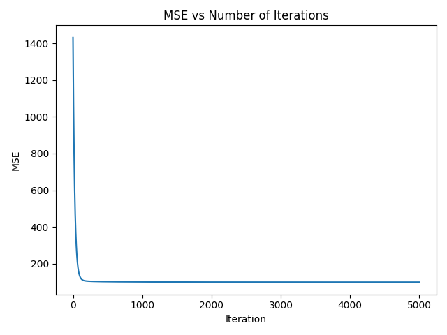
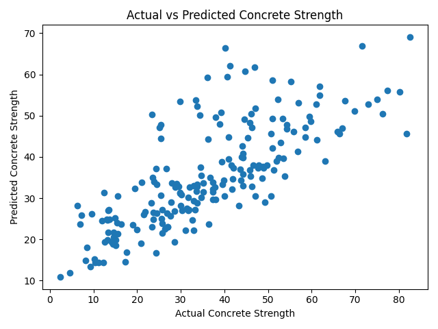
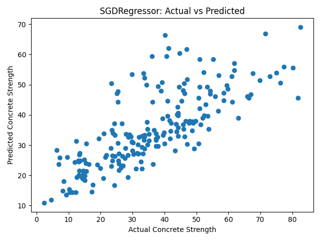
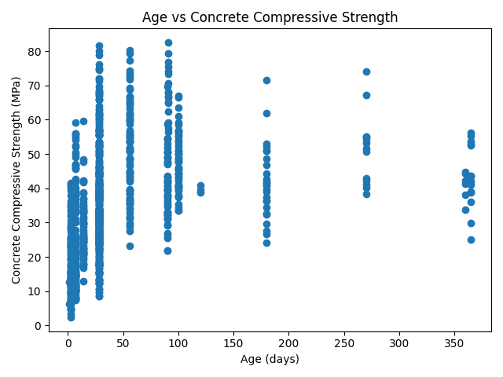
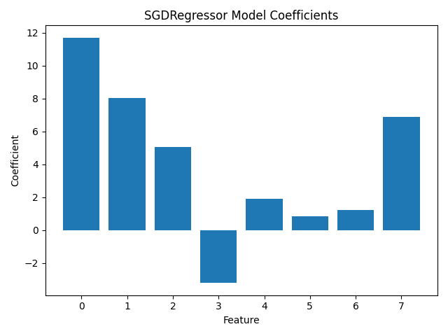

## Report

## Dataset:
I used the Concrete Compressive Strength dataset from the UCI Machine Learning Repository. The purpose of the dataset is to predict concrete compressive strength using eight input variables. The target variable is concrete compressive strength measured in MPa.

## Preprocessing:
The original dataset contained 1030 rows. There were no missing values. I found 25 duplicate rows and removed them, so 1005 rows were left. The attributes in the dataset were numerical so categorical conversion was not needed. I split the dataset into 80% training data and 20 % test data. This produced 804 training samples and 201 test samples. I standardized the input features using StandardScaler.

## Part1 Results

All parameter trials:
    learning_rate  iterations  training_mse     test_mse
0          0.0001         500   1234.049682  1333.722541
1          0.0001        1000   1028.367848  1121.259919
2          0.0001        3000    519.916989   591.203992
3          0.0001        5000    293.074844   349.827513
4          0.0010         500    292.741716   349.471127
5          0.0010        1000    132.652745   170.960800
6          0.0010        3000    103.790280   130.445279
7          0.0010        5000    102.411347   127.991168
8          0.0050         500    104.459487   131.788302
9          0.0050        1000    102.410562   127.989030
10         0.0050        3000    100.663165   125.636943
11         0.0050        5000    100.219894   125.294887
12         0.0100         500    102.409582   127.986364
13         0.0100        1000    101.199688   126.191158
14         0.0100        3000    100.135507   125.247045
15         0.0100        5000    100.044470   125.226144
16         0.0500         500    100.219116   125.294361
17         0.0500        1000    100.044405   125.226186
18         0.0500        3000    100.035898   125.245588
19         0.0500        5000    100.035898   125.245648

Best parameters:
learning_rate       0.010000
iterations       5000.000000
training_mse      100.044470
test_mse          125.226144

FINAL RESULTS
----------------------------
Best Learning Rate: 0.01
Best Iterations: 5000
Final Test MSE: 125.2261438851358
Final Test R2: 0.5802356818439047
Final Explained Variance: 0.581876845952661

Bias:
35.06697761194013

Weights:
[11.88809032  8.20486878  5.23872349 -3.03517177  1.93991869  1.01459774
  1.43732818  6.88467939]

Answer to Part1 question:
I am satisfied with the solution I found because I tested multiple combinations of learning rates and iteration counts and compared the training and test MSE values. The best result used a learning rate of 0.01 and 5000 iterations. This model had a training MSE of 100.0445 and a test MSE of 125.2261. The test R^2 was approximately 0.5802, and the explained variance was approximately 0.5819. I also observed that the MSE improved as the model trained and then became fairly stable. However, other learning rates and iteration counts could still be tested, so this is the best solution among the combinations I tested.

## Part2 Results

All SGDRegressor trials:
    learning_rate  iterations  training_mse    test_mse
0          0.0001         500    100.371144  125.406100
1          0.0001        1000    100.064371  125.226495
2          0.0001        3000    100.036295  125.247324
3          0.0001        5000    100.035936  125.248068
4          0.0010         500    100.100022  125.512822
5          0.0010        1000    100.185637  125.375171
6          0.0010        3000    100.125001  125.468610
7          0.0010        5000    100.071879  125.349931
8          0.0050         500    100.588020  126.804528
9          0.0050        1000    106.528837  130.853236
10         0.0050        3000    102.269686  127.038917
11         0.0050        5000    101.395305  126.508254
12         0.0100         500    101.247622  127.583363
13         0.0100        1000    115.156743  137.954240
14         0.0100        3000    104.531932  128.255977
15         0.0100        5000    103.421145  127.596121

Best parameters:
learning_rate       0.000100
iterations       1000.000000
training_mse      100.064371
test_mse          125.226495

FINAL RESULTS
----------------------------
Best Learning Rate: 0.0001
Best Iterations: 1000
Training MSE: 100.06437077585504
Test MSE: 125.22649519085573
Test R^2: 0.580234504249503
Explained Variance: 0.5818826027382409

Model Intercept:
[35.06568035]

Model Coefficients:
[11.69818978  8.01336164  5.07278506 -3.20366631  1.91315739  0.86290013
  1.24658886  6.88005858]

## Answer to Part2 question:
I am satisfied with the solution found. I tested multiple combinations of learning rates and iteration counts and compared the training and test MSE values. The best result used a learning rate of 0.0001 and 1000 iterations, with a training MSE of 100.0644 and a test MSE of 125.2265. The test R^2 was approximately 0.5802, and the explained varianced was approximately 0.5819. I also compared the result with my manually implemented gradient descent model from part 1. The two models produced almost identical test MSE and R^2 values, which suggests that both models reached a very similar solution. 

## Plots 
## Part 1

**MSE vs. Number of Iterations**

**Actual vs. Predicted Concrete Strength**

**Age vs. Concrete Compressive Strength**

## Part 2

**SGDRegressor Actual vs. Predicted Concrete Strength**

**Age vs. Concrete Compressive Strength for Part 2**

**SGDRegressor Model Coefficients**

## Part 1 and Part 2 Comparison:
The results from both models were almost identical. My gradient descent implementation had a test MSE of 125.2261, while SGDRegressor had a test MSE of 125.2265. Both models also had an R² of approximately 0.5802. This shows that my manually implemented gradient descent model produced results very similar to Scikit-learn's SGDRegressor.

## References
UCI Machine Learning Repository. Concrete Compressive Strength Dataset

Scikit-learn Documentation. SGDRegressor

Scikit-learn Documentation. StandardScaler